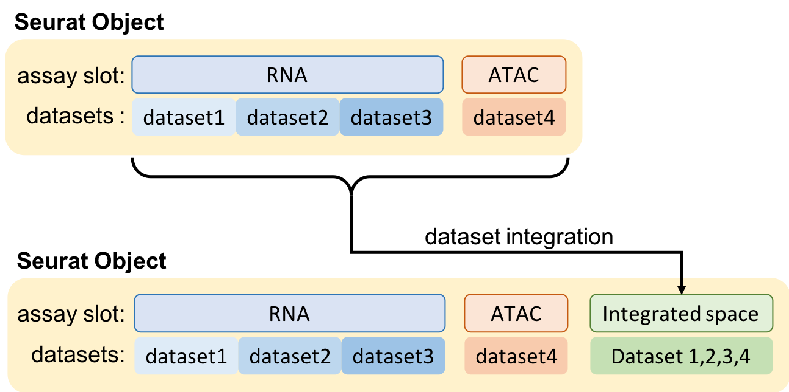

<br/>


```{r, results='asis', echo=FALSE}
sp <- dirname(sub("--file=","",commandArgs(trailingOnly = FALSE)[grep("--file=",commandArgs(trailingOnly = FALSE))]))
getwd()
```

<br/>

# Introduction

Here we give a deep understanting of the functions and parameters being used in the workflow. 

<br/>

#### Running with SLURM

**You can safely ignore these lines** in case you are using the pipeline on a single computer.

The first lines provides a convenient way to run the workflow using the SLURM queueing system on a High Performance Computing environment. 
```{bash, engine = 'bash', eval=F}
#! /bin/bash -l
#SBATCH -A projID
#SBATCH -p core
#SBATCH -n 8
#SBATCH -J Proj
#SBATCH -t 10:00:00
#SBATCH --mail-user username@email.com
#SBATCH --mail-type=END
```

<br/>

#### Initializing Sauron.v1 conda environment

**You can safely ignore these lines.**

The following lines allows the pipeline to find the main project folder (i.e. where the run_workflow.sh is located). 

The first will dictate where your data and scripts are. Because of this feature, one can simply define the path to your project as `$main`. The second will load the script to initiallize the Sauron.v1 conda environment with all necessary packages for the analysis. If you don't already have the environment, it will create it for you.
```{bash, engine = 'bash', eval=F}
main="$( cd "$( dirname "${BASH_SOURCE[0]}" )" >/dev/null 2>&1 && pwd )"
source $main/initialize.sh 2>&1 | tee $main/log/'initialize_log.txt'
```

<br/>

#### Global parameters

In these lines you can define global parameters to be user across your analysis. They should either come from the metadata file for each dataset you will provide (see below), or from the pipeline itself (see below).

These names are essentially column names in your metadata inside the Seurat Object.

By default in the Quality Control step (see below), several metrics are autmatically put into the seurat object, and those can be used for plotting here. Some of them are: `nCounts_RNA`, `nFeature_RNA` , `percent_rps` , `percent_rpl` , `percent_ribo` , `S.Score` , `G2M.Score`.

```{bash, engine = 'bash', eval=F}
var_to_plot='VARIABLE_COLUMNS_FROM_METADATA_TABLE,percent_mito,percent_ribo'
var_to_regress='nFeature_RNA,percent_mito,S.Score,G2M.Score'
```


***
<br/>

# Load datasets

```{bash, engine = 'bash', eval=F}
Rscript $script_path/00_load_data.R \
--input_path $main/'data' \
--dataset_metadata_path $main/'data/metadata.csv' \
--assay 'RNA' \
--output_path $main/'analysis/1_qc' \
2>&1 | tee $main/log/'00_load_data_log.txt'
```
`input_path`

: The PATH to the *FOLDER* containing your datasets (as folders). Each folder inside this PATH is a dataset.

`dataset_metadata_path`

: The PATH to the metadata *FILE* for each library (The first column should be named SampleID)

`assay`

: The *ASSAY* slot in the Seurat object to load the data. Default is "RNA". You can add any name that describes the type of data in that assay: "CITE", "ATAC", "PROTEIN", etc.

`output_path`

: The PATH to the *FOLDER* to output your Seurat object.

***
<br/>

To load datasets, first place them in the `data` folder: create a folder for each individual dataset, and within each folder, place your dataset (see figure below). This allows a well organized rawdata folder for the analysis.

Besides the rawdata, you can add a metadata `.csv` file, which can contain information about each specific dataset. Each line is a dataset. Each column is a metadata variable. All those values will be parsed to the Seurat object on the loading.

The loading function will also automatically take care of finding the union of all genes across datasets and adding zeros where the genes are not expressed.

{width=40%}


***
<br/>

# Run Quality Control
```{bash, engine = 'bash', eval=F}
Rscript $script_path/01_qc_filter.R \
--Seurat_object_path $main/'analysis/1_qc/raw_seurat_object.rds' \
--columns_metadata $var_to_plot \
--species_use 'mmusculus' \
--remove_non_coding 'True' \
--plot_gene_family 'RPS,RPL,mito,HB' \
--remove_gene_family 'mito' \
--min_gene_count '5' \
--min_gene_per_cell '200' \
--assay 'RNA' \
--output_path $main/analysis/1_qc \
2>&1 | tee $main/log/'01_QC_log.txt'
```
`Seurat_object_path`

: The PATH to the *Seurat Object* containing your datasets and metadata.

`columns_metadata`

: The *COLUMN NAMES* of the metadata matrix to load into the objects. They will be treated as factors variables (not continuous).

`species_use`

: Species from the sample for cell cycle scoring.

`remove_non_coding`

: Removes all non-coding and pseudogenes from the data. Default is 'True'.

`plot_gene_family`

: Gene families to calculate and add to the metadata, comma separated. You can place them as patterns of genes or gene families. Some examples are: "RPS" (ribosomal), "RPL" (ribosomal), "MT-" (mitocondria). Upper and Lower case are ignored. Default is "Rps,Rpl,mt-,Hb".

`remove_gene_family`

: Gene families to remove from the count matrix after QC, comma separated. They should start with the pattern.Upper and Lower case are ignored. Default is "mt-".

`min_gene_count`

: Minimun number of cells needed to consider a gene as expressed. Default is 5.

`min_gene_per_cell`

: Minimun number of genes in a cell needed to consider a cell as good quality. Default is 200.

`assay`

: The *ASSAY* slot in the Seurat object to load the data. Default is "RNA". You can add any name that describes the type of data in that assay: "CITE", "ATAC", "PROTEIN", etc.

`output_path`

: The PATH to the *FOLDER* to output your Seurat object.

***
<br/>


***
# Integrating datasets
```{bash, engine = 'bash', eval=F}
Rscript $script_path/02_integrate.R \
--Seurat_object_path $main/'analysis/1_qc/filt_seurat_object.rds' \
--columns_metadata $var_to_plot \
--regress $var_to_regress \
--var_genes 'seurat' \
--integration_method 'mnn,sample_id' \
--cluster_use 'NONE' \
--assay 'RNA' \
--output_path $main/'analysis/2_clustering' \
2>&1 | tee $main/log/'02_integrate_log.txt'

```
`Seurat_object_path`

: The PATH to the *Seurat Object* containing your datasets and metadata.

`columns_metadata`

: The *COLUMN NAMES* of the metadata matrix to load into the objects. They will be treated as factors variables (not continuous).

`regress`

: Variables of the metadata to be regressed out using GLM.

`var_genes`

: Whether use 'Seurat' or the 'Scran' method for variable genes identification. An additional value can be placed after a comma to define the level of dispersion wanted for variable gene selection. 'Seurat,2' will use the threshold 2 for gene dispersions. Defult is 'Seurat,1.5'. For Scran, the user should inpup the level of biological variance 'Scran,0.2'. An additional blocking parameter (a column from the metadata) can ba supplied to 'Scran' method block variation comming from uninteresting factors, which can be parsed as 'Scran,0.2,Batch'.

`integration_method`

: Integration method to be used. 'CCA', MNN', 'Scale' and 'Combat' are available at the moment. The batches (column names in the metadata matrix) to be removed should be provided as arguments comma separated. E.g.: 'Combat,sampling_day'. For MNN, an additional integer parameter is supplied as the k-nearest neighbour.

`cluster_use`

: The cluster to be used for analysis parsed as "METADATA_COLUMN_NAME,factor1,factor2". This is usefull if you want to subset your data and perform this step in only part of the dataset (a cell cluster, or a particular metadata parameter). Example: "SNN.0.4,1,2,3,4", will get clusters 1-4 from the the metadata column "SNN.0.4".

`assay`

: The *ASSAY* slot in the Seurat object to load the data. Default is "RNA". You can add any name that describes the type of data in that assay: "CITE", "ATAC", "PROTEIN", etc.

`output_path`

: The PATH to the *FOLDER* to output your Seurat object.

***
<br/>

{width=50%}


***
# Dim. reduction and Clustering
```{bash, engine = 'bash', eval=F}
Rscript $script_path/03_dr_and_cluster.R \
--Seurat_object_path $main/'analysis/2_clustering/seurat_object.rds' \
--columns_metadata $var_to_plot \
--regress $var_to_regress \
--PCs_use 'var,1' \
--var_genes 'seurat' \
--dim_reduct_use 'umap' \
--cluster_use 'none' \
--cluster_method 'HC,kmeans' \
--assay 'RNA' \
--output_path $main/'analysis/2_clustering' \
2>&1 | tee $main/log/'03_dr_and_cluster_log.txt'

```
`Seurat_object_path`

: 

`columns_metadata`

: 

`regress`

: 

`PCs_use`

: 

`var_genes`

: 

`dim_reduct_use`

: 

`cluster_use`

: 

`cluster_method`

: 

`assay`

: 

`output_path`

: 

***
<br/>


***
# Clustering correlation analysis
```{bash, engine = 'bash', eval=F}
Rscript $script_path/'05_cluster_correlation.R' \
--Seurat_object_path $main/'analysis/2_clustering/seurat_object.rds' \
--clustering_use 'HC_100' \
--exclude_cluster 'NONE' \
--merge_cluster '0.95,0.9,0.85,0.8,0.75,0.7' \
--output_path $main/'analysis/2_clustering/cluster_correlations' \
2>&1 | tee $main/'log/4_clust_corr.txt'
```


***
# Differential gene expression
```{bash, engine = 'bash', eval=F}
Rscript $script_path/04_diff_gene_expr.R \
--Seurat_object_path $main/'analysis/2_clustering/seurat_object.rds' \
--clustering_use 'HC_12' \
--metadata_use 'tech' \
--exclude_cluster 'NONE' \
--assay 'RNA' \
--o $main/'analysis/3_diff_expr' \
2>&1 | tee $main/'log/04_diff_expr_log.txt'
```


***
# Trajectory inference analysis

Also refered as "pseudotime".

```{bash, engine = 'bash', eval=F}
Rscript $script_path/07_trajectory.R \
--Seurat_object_path $main/'analysis/2_clustering/seurat_object.rds' \
--metadata_use '' \
--reduction_use '' \
--reduction_visualize '' \
--method_use '' \
--no_traj_components '' \
--no_of_paths '' \
--start_cluster '' \
--assay '' \
--output_path '' \
2>&1 | tee $main/'log/07_trajectory_log.txt'
```


***
# Cell type classification
```{bash, engine = 'bash', eval=F}
Rscript $script_path/cell_type_prdiction.R \
--Seurat_object_path $main/'analysis/2_clustering/seurat_object.rds' \
--marker_lists $main/'marer_list.csv' \
--cluster_use 'snn_0.4' \
--assay 'RNA' \
--output_path $main/'analysis/2_clustering/' \
2>&1 | tee $main/'log/cell_type_prediction_log.txt'
```


***
# Plotting custom gene lists
```{bash, engine = 'bash', eval=F}
Rscript $script_path/plot_gene_list.R \
--Seurat_object_path $main/'analysis/2_clustering/seurat_object.rds' \
--gene_list $main/'my_genes_of_interest.csv' \
--match_type 'exact' \
--clustering_use 'snn_0.4' \
--assay 'RNA' \
--output_path $main/'analysis/2_clustering/' \
2>&1 | tee $main/'log/plot_gene_list_log.txt'
```


***
# Ligand-Receptor interaction
```{bash, engine = 'bash', eval=F}
Rscript $script_path/06_lig_rec_interactome.R \
--objects_paths $main/'analysis/2_clustering/seurat_object.rds' \
--object_names 'all_cells' \
--object_clusters 'HC_12,1,2,3,4' \
--lig_recp_database 'DEFAULT' \
--ligand_objects 'all_cells' \
--receptor_objects 'all_cells' \
--species_use 'hsapiens' \
--metadata_ligands 'tech' \
--metadata_receptor 'tech' \
--filter_thresholds '0.1,0.1,3' \
--output_path $main/'analysis/5_Lig_Rec_interaction' \
--assay 'RNA' \
2>&1 | tee $main/'log/06_Interactome_EPI_log.txt'
```


***
# VDJ analysis
```{bash, engine = 'bash', eval=F}


```


