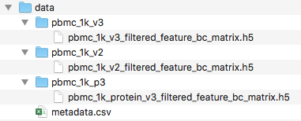

<br/>


This is a basic guided analysis for using 3 PBMC datasets

<br/>

# Install software dependecies

The only two softwares needed are [ **Conda** ](https://docs.conda.io/projects/conda/en/latest/user-guide/install/) and [ **git** ](https://www.atlassian.com/git/tutorials/install-git). They should be installed using their instructions.

All other software used in Sauron is managed by Conda environment and will be installed automatically. These includes **R** , **Rstudio** , **Python** and all necessary packages / libraries to run the workflow. The complete list with software and their versions can be found in the `environment.yml` file.

<br/>

# Clone this repository

First, you will need to clone this repo into your project folder.
For this tutorial we will create a folder `MyProject` inside our `Downloads` folder:

```{bash, eval=F}
mkdir ~/Downloads/MyProject

cd ~/Downloads/MyProject

git clone https://czarnewski@bitbucket.org/scilifelab-lts/sauron.git
```

This will create a folder named "sauron" in your project folder, contating all the files required for the analysis.

Alternativelly, you can also simply create these folders and download the repository manually. Your folder structure should look like this:

{width=30%}

<br/>

# Downloading the PBMC dataset

Here, we will download 3 PBMC datasets to work with. All datasets will be put into the `data` folder. Each dataset should be placed individually within its own folder. This enforces the user to have well confided raw data condicent with good data management practices. This further allows designing ver complex designs using the metadata table.

```{bash, eval=F}
cd ~/Downloads/MyProject/sauron/data

mkdir pbmc_1k_v2
curl -o pbmc_1k_v2/pbmc_1k_v2_filtered_feature_bc_matrix.h5 -O \
http://cf.10xgenomics.com/samples/cell-exp/3.0.0/pbmc_1k_v2/pbmc_1k_v2_filtered_feature_bc_matrix.h5

mkdir pbmc_1k_v3
curl -o pbmc_1k_v3/pbmc_1k_v3_filtered_feature_bc_matrix.h5 -O \
http://cf.10xgenomics.com/samples/cell-exp/3.0.0/pbmc_1k_v3/pbmc_1k_v3_filtered_feature_bc_matrix.h5

mkdir pbmc_1k_p3
curl -o pbmc_1k_p3/pbmc_1k_protein_v3_filtered_feature_bc_matrix.h5 -O \
http://cf.10xgenomics.com/samples/cell-exp/3.0.0/pbmc_1k_protein_v3/pbmc_1k_protein_v3_filtered_feature_bc_matrix.h5
```


<br/>

# Adding metadata to your folder

Add your data and metadata into the `data` directory. One dataset matrix per folder (i.e. one plate per folder or one 10X lane per folder). Name each folder as the desired sample names. The sample names should match the names in the 1st column of you metadata csv file.

We will manually add information into the metadata file (which can be created with any spread sheet editor) and saved as `.csv`.

{width=30%}

It is important to notice that each line corresponds to a dataset and the **first column** is exactly the name of the dataset folders. Only names found in both the metadata and in the data folder will be used.

<br/>

Your final folder should look like this:

{width=45%}


# Loading the data


