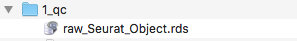
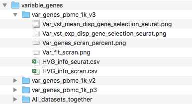
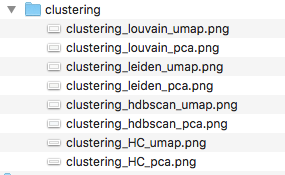

<style type="text/css">

body{ /* Normal  */
      font-size: 14px;
  }
td {  /* Table  */
  font-size: 14px;
}
h1.title {
  font-size: 24px;
  color: DarkBlue;
}
h1 { /* Header 1 */
  font-size: 20px;
  color: DarkRed;
}
h2 { /* Header 2 */
    font-size: 16px;
}
h3 { /* Header 3 */
  font-size: 18px;
  font-family: "Times New Roman", Times, serif;
}
code.r{ /* Code block */
    font-size: 14px;
}
pre { /* Code block - determines code spacing between lines */
    font-size: 14px;
}
</style>


<br/>


This is a basic guided analysis for using 3 PBMC datasets

<br/>

# Install software dependecies

The only two softwares needed are [ **Conda** ](https://docs.conda.io/projects/conda/en/latest/user-guide/install/) and [ **git** ](https://www.atlassian.com/git/tutorials/install-git). They should be installed using their instructions.

All other software used in Sauron is managed by Conda environment and will be installed automatically. These includes **R** , **Rstudio** , **Python** and all necessary packages / libraries to run the workflow. The complete list with software and their versions can be found in the `environment.yml` file.

<br/>

# Clone this repository

First, you will need to clone this repo into your project folder.
For this tutorial we will create a folder `sauron_tutorial_PBMC` inside our `Downloads` folder:


```bash
mkdir ~/Downloads/sauron_tutorial_PBMC

cd ~/Downloads/sauron_tutorial_PBMC

git clone https://czarnewski@bitbucket.org/scilifelab-lts/sauron.git
```

This will create a folder named "sauron" in your project folder, contating all the files required for the analysis.

Alternativelly, you can also simply create these folders and download the repository manually. Your folder structure should look like this:

{width=40%}

<br/>

# Download PBMC dataset

Here, we will download 3 PBMC datasets to work with. All datasets will be put into the `data` folder. Each dataset should be placed individually within its own folder. This enforces the user to have well confided raw data condicent with good data management practices. This further allows designing ver complex designs using the metadata table.


```bash
cd ~/Downloads/sauron_tutorial_PBMC/sauron/data

mkdir pbmc_1k_v2
curl -o pbmc_1k_v2/pbmc_1k_v2_filtered_feature_bc_matrix.h5 -O \
http://cf.10xgenomics.com/samples/cell-exp/3.0.0/pbmc_1k_v2/pbmc_1k_v2_filtered_feature_bc_matrix.h5

mkdir pbmc_1k_v3
curl -o pbmc_1k_v3/pbmc_1k_v3_filtered_feature_bc_matrix.h5 -O \
http://cf.10xgenomics.com/samples/cell-exp/3.0.0/pbmc_1k_v3/pbmc_1k_v3_filtered_feature_bc_matrix.h5

mkdir pbmc_1k_p3
curl -o pbmc_1k_p3/pbmc_1k_protein_v3_filtered_feature_bc_matrix.h5 -O \
http://cf.10xgenomics.com/samples/cell-exp/3.0.0/pbmc_1k_protein_v3/pbmc_1k_protein_v3_filtered_feature_bc_matrix.h5
```


<br/>

***
# Adding metadata to your folder

Add your data and metadata into the `data` directory. One dataset matrix per folder (i.e. one plate per folder or one 10X lane per folder). Name each folder as the desired sample names. The sample names should match the names in the 1st column of you metadata csv file.

We will manually add information into the metadata file (which can be created with any spread sheet editor) and saved as `.csv`.

{width=40%}

It is important to notice that each line corresponds to a dataset and the **first column** is exactly the name of the dataset folders. Only names found in both the metadata and in the data folder will be used.

<br/>

Your final folder should look like this:

{width=50%}

<br/>

***
# Loading the data

With the data in place, we can now define some anlaysis parameters and then load it to Sauron. Here we will define some metadata parameters we would like to use for plotting later on. Those are defined based on the column names of the metadata file above.


```bash
var_to_plot='assay,chemistry'
var_to_regress='nFeature_RNA,percent_mito,S.Score,G2M.Score'
```

We can now load them using the `00_load_data.R` function. 


```bash
Rscript $script_path/00_load_data.R \
--input_path $main/'data' \
--dataset_metadata_path $main/'data/metadata.csv' \
--assay 'rna' \
--output_path $main/'analysis/1_qc' \
2>&1 | tee $main/log/'00_load_data_log.txt'
```

This will create a seurat object with a slot named `rna` containing all the counts. The results will be outputed in the folder `analysis/1_qc`. The log file after running this function can be seen in the log folder `log/00_load_data_log.txt`. There should be now a `raw_seurat_object.rds` in your qc folder..

{width=45%}

<br/>

***
# Quality control

Once the data is loaded into the Seurat object, it becomes easy to work with it and perform several quality control (QC) metris using the function `01_qc_filter.R`. By default, this function will compute cell cycle scoring, remove non-coding genes (including pseudogenes), calculate percentage of several gene families. 


```bash
Rscript $script_path/01_qc_filter.R \
--Seurat_object_path $main/'analysis/1_qc/raw_seurat_object.rds' \
--columns_metadata $var_to_plot \
--species_use 'hsapiens' \
--remove_non_coding 'True' \
--plot_gene_family 'RPS,RPL,mito,HB' \
--remove_gene_family 'mito' \
--min_gene_count '5' \
--min_gene_per_cell '200' \
--assay 'rna' \
--output_path $main/analysis/1_qc \
2>&1 | tee $main/log/'01_QC_log.txt'
```

By default, this function will calculate several percentage estimates and output two kind of files, either contating ALL/RAW cells or FILTERED cells only. Thus, you can later choose which to proceed if you dont want to exclude any cell at first. Your folder should look like this:

{width=40%}


By default, cells need to be within:

* 0 - 25 % mitocondrial genes
* 0 - 50 % RPS genes
* 0 - 50 % RPL genes
* 0.5 - 99.5 quantiles of number UMIs (removing extreme ouliers)
* 0.5 - 99.5 quantiles of number of counts (removing extreme ouliers)
* 90 - 100 % protein coding genes
* .9 - 1 Gini index
* .95 - 1 Simpson index


Some of the outputed plots can be found below, before and after filtering:

<details>
  
  **ALL cells**
  
  
  
  <br/>
  
  **FILTERED cells only**
  
  
  
</details>

<br/>

***
# Dataset integration

Once low quality cells were filtered out we can proceed to integrate the datasets with the function `02_integrate.R`. It will adjust for batch effects if present and output into a integrated space in the corresponding slot. Currently implemented methods are `mnn`, `cca`, and `combat`. MNN is the fastest and will be used here, but it does not generate a corrected gene expression matrix. Therefore, we will use it only to reduce dimentions and perform clustering later on. 


```bash
Rscript $script_path/02_integrate.R \
--Seurat_object_path $main/'analysis/1_qc/filt_seurat_object.rds' \
--columns_metadata $var_to_plot \
--regress $var_to_regress \
--var_genes 'seurat' \
--integration_method 'mnn,dataset' \
--cluster_use 'NONE' \
--assay 'rna' \
--output_path $main/'analysis/2_clustering' \
2>&1 | tee $main/log/'02_integrate_log.txt'
```

Now there should be a folder named 2_clustering containig the your seurat object. This object contains everything from the one used as imput plus the integrated slot and variable genes computed.

{width=33%}

This function will then calculate variable genes using both scran and seurat methods for each dataset and for all datasets together. It will output them into the `variable_genes` folder, which should look like this:

**Variable genes folder**

{width=50%}

<br/>

***
# Dim. Reduction & Clustering


```bash
Rscript $script_path/03_dr_and_cluster.R \
--Seurat_object_path $main/'analysis/2_clustering/seurat_object.rds' \
--columns_metadata $var_to_plot \
--regress $var_to_regress \
--PCs_use 'var,1' \
--var_genes 'seurat' \
--dim_reduct_use 'umap' \
--cluster_use 'none' \
--cluster_method 'leiden,louvain,hdbscan,hc' \
--assay 'mnn' \
--output_path $main/'analysis/2_clustering' \
2>&1 | tee $main/log/'03_dr_and_cluster_log.txt'

```

After running this function, several files and folders should appear in your output folder, which will look something like this:

{width=39%}


**PCA folder**

{width=45%}

**UMAP folder**

{width=45%}

**Clustering folder**

{width=39%}

# Clustering analysis


```bash
Rscript $script_path/'05_cluster_correlation.R' \
--Seurat_object_path $main/'analysis/2_clustering/seurat_object.rds' \
--clustering_use 'HC_12' \
--exclude_cluster 'NONE' \
--merge_cluster '0.95,0.9,0.85,0.8,0.75,0.7' \
--output_path $main/'analysis/2_clustering/cluster_correlations' \
2>&1 | tee $main/'log/4_clust_corr.txt'
```


# Gene expression testing


```bash

Rscript $script_path/04_diff_gene_expr.R \
--Seurat_object_path $main/'analysis/2_clustering/seurat_object.rds' \
--clustering_use 'merged_0.8' \
--metadata_use 'dataset' \
--exclude_cluster 'NONE' \
--assay 'rna' \
--output_path $main/'analysis/2_clustering/diff_expr' \
2>&1 | tee $main/'log/5_diff_expr_log.txt'
```


# Cell type prediction


```bash
Rscript $script_path/cell_type_prdiction.R \
--Seurat_object_path $main/'analysis/2_clustering/seurat_object.rds' \
--marker_lists $main/'marer_list.csv' \
--cluster_use 'snn_0.4' \
--assay 'RNA' \
--output_path $main/'analysis/2_clustering/' \
2>&1 | tee $main/'log/cell_type_prediction_log.txt'
```


