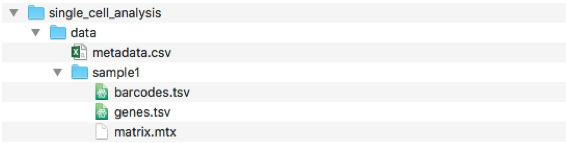
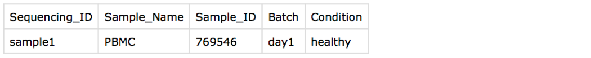

===============
Guided Analysis
===============
.. highlight:: sh

Pre-requisites
--------------

You should first install:
  * R
  * git
  * Atom or Sublime (or any other bash-aware text editor, just to make things easier)

If you have windows, you should also install:
  * MobaXterm (to access unix command line)
  * 7zip (to unzip tar files)

Step 1 - Setup
--------------
1.1. Open Terminal or MobaXterm

1.2. Create your project folder (if you don't already have one)::

  mkdir ~/Desktop/MyProject

1.3. go to your project folder. Here, we are creating a `MyProject` folder on the Desktop::

  cd ~/Desktop/MyProject

1.4. Clone the repository for your single cell analysis::

  git clone https://czarnewski@bitbucket.org/scilifelab-lts/single_cell_analysis.git

1.5. Looking at directory, you should see a folder named single_cell_analysis containing the whole repository.

.. image:: ./../img/tutorial/repo_folder.png
    :width: 600

1.6. Download the data to be used in this tutorial. We will be using data from 10X Genomics::

  https://s3-us-west-2.amazonaws.com/10x.files/samples/cell/pbmc3k/pbmc3k_filtered_gene_bc_matrices.tar.gz

You should extract the folder contents into the `data` directory, renaming the folder for each sample number. The final data directory should look like this.

We already provided a example sheet containing the metadata information in `.csv` (v.2) for this tutorial. You can simply edit it in EXCEL or most text editors. The first column should match exactly the folder names. Each sample should be put below (the order does not matter). Each column contains more information about the sample (which were simulated here).

Step 2 - Editing the workflow
-----------------------------

2.1. Open the `run_workflow.sh` file with Atom (or any other bash-aware text editor). You will see that the first lines contain information about submitting jobs via SLURM queueing system. For the purposes of this tutorial, you can simply ignore those if you are running on your local computer.

::
  #! /bin/bash -l
  #SBATCH -A proj_number
  #SBATCH -p core
  #SBATCH -n 8
  #SBATCH -J proj_ID
  #SBATCH -t 16:00:00
  #SBATCH --mail-user username@email.com
  #SBATCH --mail-type=END

  #Load modules on UPPMAX
  #Uncomment the line below if working on your local computer
  #module load bioinfo-tools
  #module load R/3.5.0
  #module load R_packages/3.5.0

2.2. Next, we can edit the variables and directory paths in the lines that follow.

::
  #Define common variables and folder here
  var_to_plot='Sequencing_ID,Sample_Name,Sample_ID,Batch,Condition'
  var_to_regress='nUMI,percent.mito,S.Score,G2M.Score'
  script_path='~/Desktop/MyProject/single_cell_analysis/scripts'
  main='~/Desktop/MyProject/single_cell_analysis'
  cd $main

Please refer to LINK for details about this, but in short:

  * `var_to_plot` are column names in the `metadata.csv` file.
  * `var_to_regress` are variables that should be regressed from the data. Those will be generated by the pipeline itself later on. Batches (column name in your metadata) can be added here.
  * `script_path` is the folder where the pipeline scripts are.
  * `main` is the root folder of your analysis.

2.3. Next, we need to edit the functions to load data, run quality control and clustering.

::
    ###Create Seurat object from 10x raw UMI counts
    Rscript $script_path/00_load_data.R \
    	-i $main/data \
    	-m $main/data/metadata.csv \
    	-c $var_to_plot \
    	-o $main/analysis/1-QC_and_Filtering \
    	2>&1 | tee $main/analysis/0_Import10X_log.txt

Here, we define the input path (`-i`) where our samples are, the file containing the metadata (`-m`), the column in the metadata with the variables we want to plot (`-c`), and the output directory (`-o`). The last bit `2>&1 | tee` is to export a log file of the run.

Step 3 - Run QC and clustering
------------------------------

3.1. First, we need to

Step 4
------

Step 5
------
