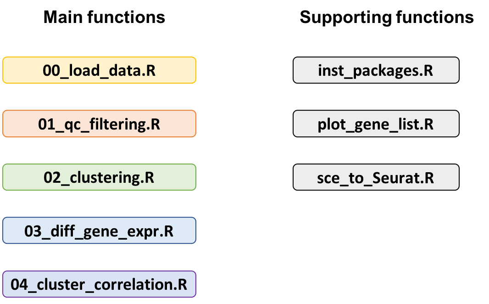

=============================
Single cell analysis workflow
=============================
.. highlight:: sh

Welcome to the Single cell Analysis workflow.
The source code of this workflow can be found on `bitbucket <https://bitbucket.org/czarnewski/single_cell_analysis/src/master/>`_.

It contains the following functions:

Some text.

Some text.

1. Download workflow
--------------------
Some text.

Checkout the latest version of this repository::
.. code:: bash
  git clone https://czarnewski@bitbucket.org/czarnewski/single_cell_analysis.git

2. Setup working directories
----------------------------
Some text.

Checkout the latest version of this repository::

    git clone https://czarnewski@bitbucket.org/czarnewski/single_cell_analysis.git

3. Edit workflow
----------------
Some text.

4. Run workflow
---------------
Some text.

It contains the following functions:

.. image:: ./img/functions_img.png
    :width: 600
    :alt: Weighted hits plot
